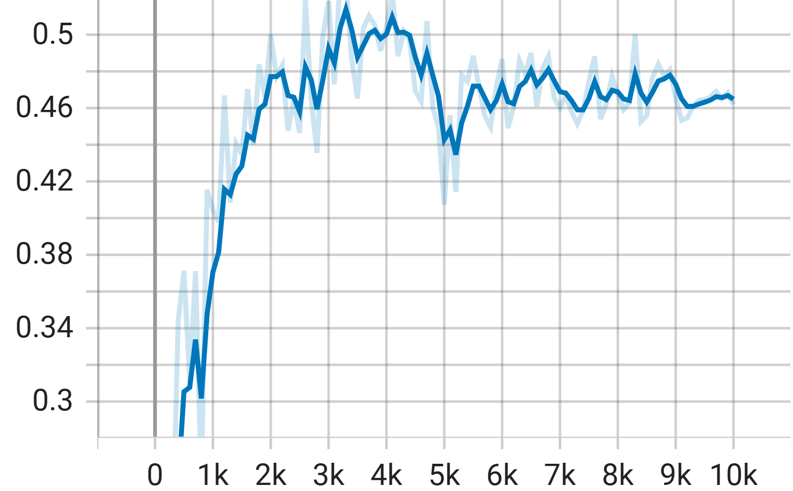
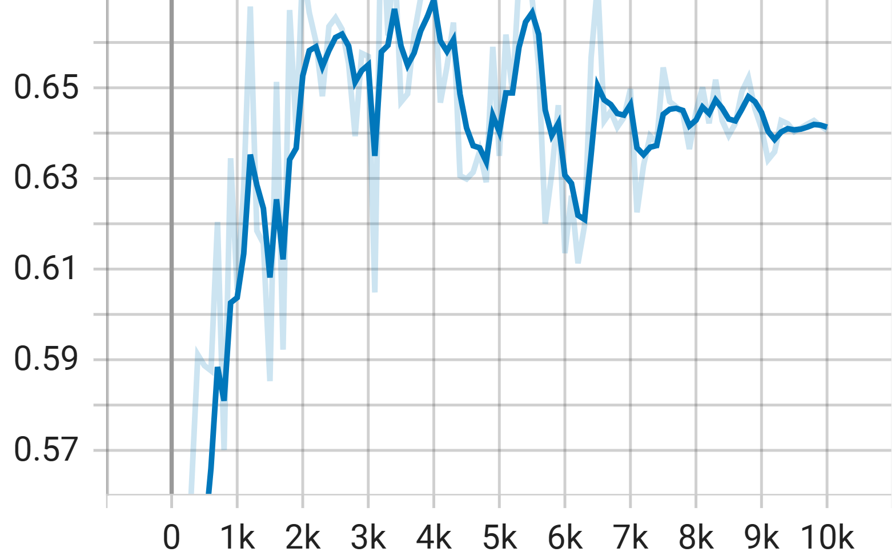
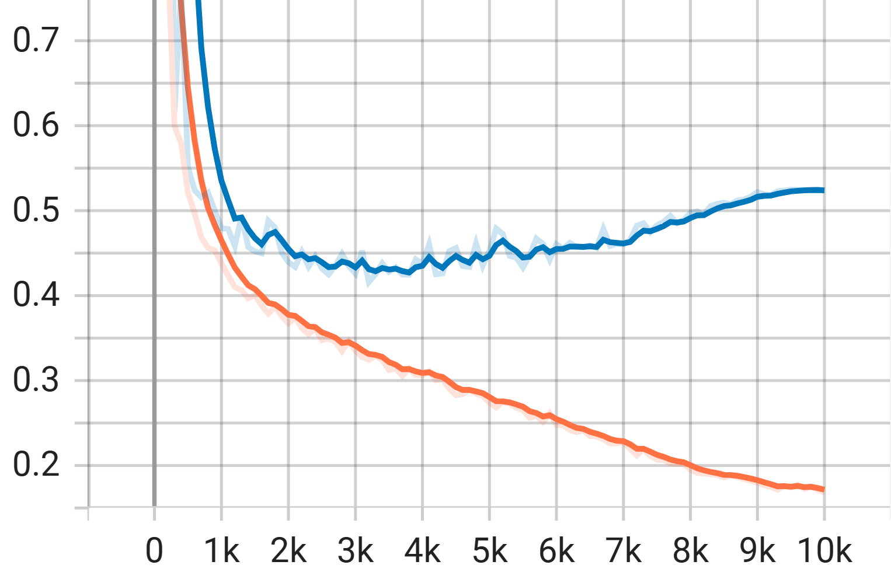

# Blood Cells Detection on BCCD Dataset
The project fine-tuned a RetinaNet model with a ResNet-50 backbone from the [TensorFlow Model Garden (TFM)](https://github.com/tensorflow/models) for detecting three types of blood cells (Red Blood Cells (RBCs), White Blood Cells (WBCs), and Platelets) in microscopic images from the [BCCD dataset](https://github.com/Shenggan/BCCD_Dataset).

## Project Overview
While on a quest to join the ranks of blood donors (unfortunately, my red blood cell count, or RBCs, had other plans – shoutout to iron supplements!), I encountered a familiar foe: the lengthy wait times after deferral. Those 30-45 minute delays sparked this project!

Built with the help of Github Codespace and powered by Colab's free GPU with TensorFlow 2.16.0, it takes about an hour to train for 10,000 epochs. 
There're two versions: [Colab notebook](https://colab.research.google.com/drive/1PsVqMfThRWEhOG1w2HDbs7OgICSIMd2d?usp=drive_link), and [Bash script](https://colab.research.google.com/drive/1JZz1ii55jRZZt5148D4OIebGfxjJsKV_?usp=sharing) which also run on Colab. 

(Huge appreciation for Google!! 😉) 

## Bash script version
### 1. Make a copy of BCCD dataset and the script from this github repository.
```
git clone https://github.com/Shenggan/BCCD_Dataset
cd Blood-Cells-Detection
git clone -b add_bash_scripts --single-branch https://github.com/EveTLynn/Blood-Cells-Detection
```
### 2. Install packages
Colab pretty much pre-installed everything, for training on Colab, only need to install the Tensorflow Model API.
```
pip install -U -q "tf-models-official"
```
Some other packages might need to be installed if not training on Colab
```
pip install albumentations pandas tqdm
pip install opencv-python opencv-python-headless

# if can't import cv2:  install libgl1-mesa-glx package which contains the OpenGL library
sudo apt-get update
sudo apt-get install libgl1-mesa-glx
```
### 3. Split; Augment data; Convert annotations to COCO format; Generate TFRecords; Train and Evaluate
The next steps includes:
- Split the BCCD dataset into train, validation and test set using `split_img_anno.py`
- Augment images and annotation using `augmentation.py`
- Convert annotations from PASCAL VOC format to COCO format using `voc2coco.py` from [Roboflow github](https://github.com/roboflow/voc2coco)
- Generate TFRecords using `create_coco_tf_record.py` from [TFM official vision github](https://github.com/tensorflow/models/blob/master/official/vision/data/create_coco_tf_record.py)
- Set up configuration, Train and evaluate, Export trained model in SavedModel format using `train.py`

The steps can be run seperatedly (the default arguments for the scripts have been set to fit this project, change as needed) by simply call `python script_name.py` to run the script with default values.
Or using the `main.sh` script which incorporate all the steps. To run the bash script, add excute permission and run it as below.
```
chmod u+x main.sh
./main.sh
```
### 4. Inference
The final step is to run inference on test set with `inference.py`. The test data need to be in TFRecord format. Specify the number of examples per image for inference, and the script will return one image of all ground truth boxes and one image of all predicted boxes inferenced by the SavedModel. 
```
python ./scripts/inference.py --num_of_examples=18
```
For more details on what each script does, please read the notebook version below.

## Notebook version

The notebook wil guide you through the following steps:

### 1 . Data Preparation
For convenience, the split and augmentation scripts are incoporated into `custom_preprocessing.py` and import to the notebook as functions.

- Clone the [BCCD dataset](https://github.com/Shenggan/BCCD_Dataset) for the blood images and annotations and this github repo for `custom_preprocessing.py`, `voc2coco.py`, and `labels.txt` scripts. The voc2coco scripts is from the [Roboflow github](https://github.com/roboflow/voc2coco) and a copy of it is stored in this repository for convenience.
- Use functions from `custom_preprocessing.py` to split images and annotations to three separate folders: train, val, test
- Augment images and annotations (random cropping, flipping, etc.) with Albumentations library, also utilize the functions from `custom_preprocessing.py`. 
- Convert annotations from PASCAL VOC format to COCO format using `voc2coco.py` script
- Generate [TFRecords](https://www.tensorflow.org/tutorials/load_data/tfrecord) with `create_coco_tf_record` method from TFM package, it is a TensorFlow simple format for storing a sequence of binary records.

After this step the working directory will have a structure like below
```
working_dir
├── augmented_data                      # Augemented data
│  ├── bccd_coco_tfrecords              # This folder contains tfrecords for train, val and test data 
│  ├── test
│  ├── train
│  └── val                              # The structure of test, train, val folder is the same
│       ├── annotations
│       ├── images
│       ├── filenames.txt               # Names of the annotation files without the extension
│       └── val_cocoformat.json         # Annotation after convert from PASCAL VOC to COCO format
|── bccd_dataset                        # Splited bccd dataset
|       ├── test
|       ├── train
|       └── val                         # The structure of test, train, val folder is the same
|            ├── annotations
|            ├── images
|            └── val.txt                # Names of the annotation files without the extension
```

### 2. Model Configuration
- Get the `retinanet_resnetfpn_coco` experiment configuration from TFM experiment factory
- Adjust the model and dataset configurations
  - Backbone: Get the pretrained checkpoint from [TFM official vision model github](https://github.com/tensorflow/models/blob/master/official/vision/MODEL_GARDEN.md), initiate pretrained checkpoint and freeze backbone (keep the backbone's weight from being updated)
  - Define image size, number of class, input paths (train and validation)
- Adjust the trainer configuration (train - val steps, optimizer, saving checkpoints..)
- Set up the distribution stratergy takes full advantage of available hardware
- Create the Task object: an easy way to build, train, and evaluate models 

### 3. Training and Evaluation
- Train the fine-tuned model on the prepared TFRecord data
- Monitor training progress using TensorBoard: the Tensorboard read `events.out.tfevents` and visualize as charts which can help us understand how the model is performing during training and diagnose any issues.
- Evaluate the model's performance on a held-out validation set using [COCO detection evaluation metrics](https://cocodataset.org/#detection-eval), but as TF allow to export best model based on only one metric, I chose mean average precision for simplicity
- 5 newest models are saved by default and I also keep the model with the highest mAP (this will be used for inference later)

Here is the output directory tree
```
retina_resnetfpn_coco
├── base_ckpt                          # Contains pretrained checkpoint from TFM
├── trained_model
│  ├── best_checkpoints                # Checkpoint with the highest mAP
│  ├── train                           # Contains train tfevent file for Tensorboard
│  ├── val                             # Contains validation tfevent file for Tensorboard
│  ├── ckpt-100.data-00000-of-00000    # 5 newest checkpoints 
│  └── ckpt-100.index
└── exported_model                     # Stores exported model used for inference
```

Due to the random nature of data augmentation, each training run with the same model architecture will produce slightly different results. 

I performed 4-5 training runs each with 10,000 epochs to get a broader picture of the model's performance, it seems that the mean Average Precision (mAP) and validation loss stopped improving significantly after approximately 4,000 epochs. The best mAP achieved across these runs fell within a range of 52% to 58%. 

Below is the last training and evaluation results.

 |  | |
:------------------: | :------------------: | :------------------:|
Mean Average Precison |  Mean Average Recall | Model Loss

It's clear that after roughly 3500 epochs, the mAP, mAR and also validation loss stagnated or even started to deteriorate. This behavior suggests that the model might be overfitting the training data.

Since the dataset size is relatively small, with only 364 images, overfitting is a potential concern. Though, indeed, the results could be improved, I decided to settle to the current model for now. I saved the checkpoint at 3500 epochs (the highest mAP) for generating predictions on new data.

### 4. Inference
- Load the exported model in [SavedModel format](https://www.tensorflow.org/guide/saved_model) and its inference function. A copy of the exported model can be found [here](https://umpedu-my.sharepoint.com/:u:/g/personal/tklinh_duoc16_ump_edu_vn/ES0xi06qoRpCukdCUe4Z3cgBC3Xvn89cINeyj2BAxlBoeg?e=IimPm7).
- Apply the model to detect blood cells on test set. The model will return 3 paramters:
  - `detection_boxes`: the coordinates of the bounding boxes
  - `detection_classes`: RBC, WBC or Platelets
  - `detection_scores`: from 0 to 1. This represents the model's certainty that the bounding box actually contains the predicted object class
- Filter out the boxes that have `detection_scores` < 0.3 and count the number of cells for each blood type

Below are the visualization of the blood images from test set with their ground truth boxes and the images with the predicted boxes.

  |
:-------------------------:
Visualization of groundtruth bounding boxes

|
:-------------------------:
Visualization of predicted bounding boxes

The model actually detects the blood cells accurately despite not having very good mAP!   

---
**PS:** This project has been an incredible learning journey, and I couldn't have made it without the amazing Ms. Tyna as my mentor from the [PyLadies Vienna Mentorship program](https://pyladies.at/)! 
Her support made this project a total joy to work on. Huge thanks for all the guidance and encouragement!

Also, thanks to my friend who told me to learn bash scripting. I'm now less scared of the blinking dollar sign 😅.

**PPS: I'm Always Learning!**

This repository is a work in progress, and I welcome your contributions! If you have any suggestions for improvement, feel free to open an issue or submit a pull request. I'm always looking for ways to enhance this project and make it more valuable for the community. 

(I haven't yet found way to implement Early Stopping with TFM which would help reduce wasted time for training. If anyone know how, I would appreciate of you could show me how😀)

**PPPS: Thank you for reading this far =))**

This project is for learning purpose. I hope you have fun reading it as much as when I wrote this😉.
