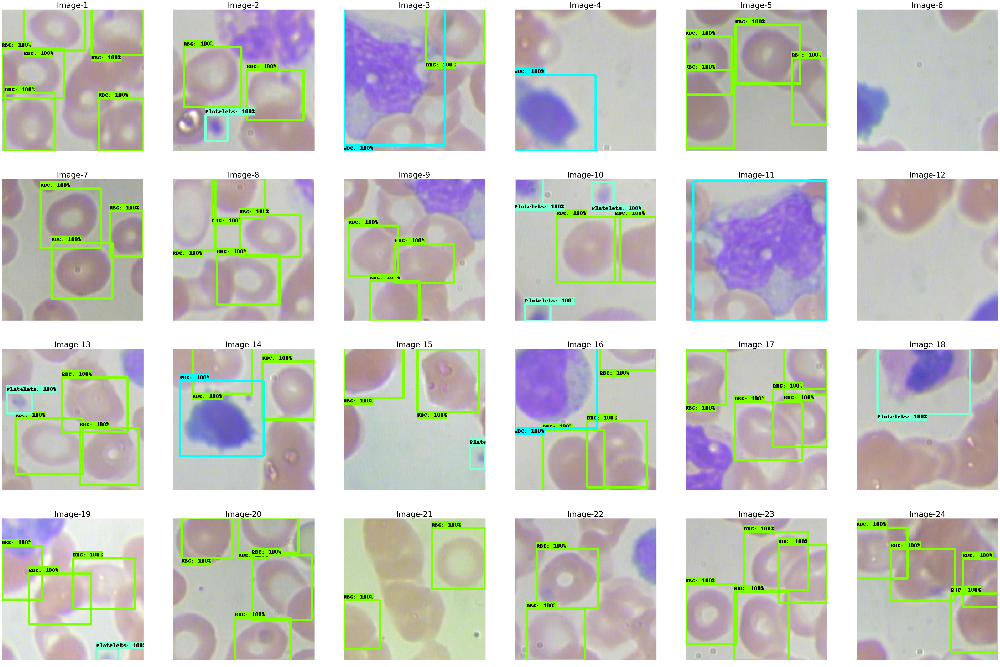
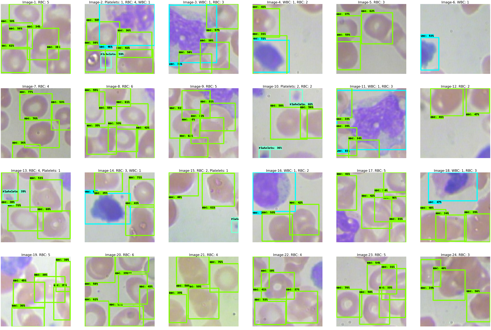

# Blood Cells Detection on BCCD Dataset
This project implements fine-tuning of a RetinaNet model with a ResNet-50 backbone from the [TensorFlow Model Garden (TFM)](https://github.com/tensorflow/models) for detecting three types of blood cells (Red Blood Cells (RBCs), White Blood Cells (WBCs), and Platelets) in microscopic images from the [BCCD dataset](https://github.com/Shenggan/BCCD_Dataset).

## Project Overview
This project is run on Colab free GPU with Tensorflow 2.15.0, iot will take approximately 1 hour to run for 10,000 epochs. A copy of the notebook is available in this repository but since its size is too large for rendering on Github, please use [nbviewer](https://nbviewer.org/)
or visit [this Colab link](https://colab.research.google.com/github/EveTLynn/Blood-Type-Detection/blob/main/Object_Detection_with_RetinaResnet_(TFM).ipynb). 

The notebook wil guide you through the following steps:

### 1 . Data Preparation
- Clone the BCCD dataset and this github repo for custom_preprocessing.py, voc2coco.py, and labels.txt scripts. The voc2coco scripts is from the [Roboflow github](https://github.com/roboflow/voc2coco) and a copy of it is stored in this repository for convenience.
- Split images, annotations to 3 folders: train, val, test
- Augment images and annotations (random cropping, flipping, etc.) with Albumentations library
- Convert annotations from PASCAL VOC format to COCO format
- Generate [TFRecords](https://www.tensorflow.org/tutorials/load_data/tfrecord), a TensorFlow-optimized data format for efficient training.

After this step the structure of the working directory will have structure like below
```
Blood-Cells-Detection
├── augmented_data                      # Augemented data
│  ├── bccd_coco_tfrecords              # This folder contains tfrecords for train, val and test data 
│  ├── test
│  ├── train
│  └── val                              # The structure of test, train, val folder is the same
│       ├── annotations
│       ├── images
│       ├── filenames.txt               # Names of the annotation files without the extension
│       └── val_cocoformat.json         # Annotation after convert from PASCAL VOC to COCO format
|── bccd_dataset                        # Splited bccd dataset
|       ├── test
|       ├── train
|       └── val                         # The structure of test, train, val folder is the same
|            ├── annotations
|            ├── images
|            └── val.txt                # Names of the annotation files without the extension
└── scripts
        ├── custom_preprocessing.py     # A script to preprocess data for voc2coco script
        |── labels.txt                  # A text file contain name of each blood type for encoding
        └── voc2coco.py                 # A script to convert xml file to coco format
```

### 2. Model Configuration
Leverage the TFM package to access the pre-trained RetinaNet model with a ResNet-50 backbone.
- Adjust the model, dataset and trainer configuration, including:
  - Get the pretrained checkpoint from [TFM official vison model github](https://github.com/tensorflow/models/blob/master/official/vision/MODEL_GARDEN.md)
  - Adjust the model and dataset configurations (initiate checkpoint, freeze backbone, define input...)
  - Adjust the trainer configuration (train - val steps, optimizer, saving checkpoints..)
- Set up the distribution stratergy takes full advantage of available hardware
- Create the Task object: an easy way to build, train, and evaluate models 

### 3. Training and Evaluation
- Train the fine-tuned model on the prepared TFRecord data.
- Monitor training progress using TensorBoard.
- Evaluate the model's performance on a held-out validation set using mean Average Precision (mAP)
- Export the model with the highest mAP

Since the augmentation is random, the results from each run will be different. I find that the mAP and validation loss won't improve much or not at all after around 5000 epochs.
The best mAP is around 52%-58%

### 4. Inference:
- Load the trained model weights.
- Apply the model to detect blood cells in new, unseen images.
- The model will output bounding boxes and class labels for identified cells with the counting for each blood cells type.

TODO: add some inference results
  |
:-------------------------:
Visualization of groundtruth bounding boxes

|
:-------------------------:
Visualization of predicted bounding boxes

**I'm Always Learning!**

This repository is a work in progress, and I welcome your contributions! If you have any suggestions for improvement, feel free to open an issue or submit a pull request. I'm always looking for ways to enhance this project and make it more valuable for the community. 
